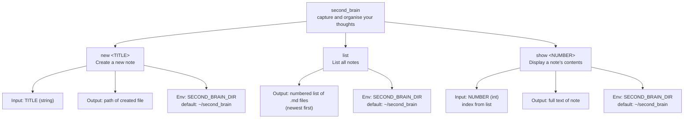

# CLI Commands

```mermaid
flowchart TD
    CLI["second_brain\ncapture and organise your thoughts"]

    CLI --> NEW["new &lt;TITLE&gt;\nCreate a new note"]
    CLI --> LIST["list\nList all notes"]
    CLI --> SHOW["show &lt;NUMBER&gt;\nDisplay a note's contents"]

    NEW --> NEW_IN["Input: TITLE (string)"]
    NEW --> NEW_OUT["Output: path of created file"]
    NEW --> NEW_ENV["Env: SECOND_BRAIN_DIR\ndefault: ~/second_brain"]

    LIST --> LIST_OUT["Output: numbered list of .md files\n(newest first)"]
    LIST --> LIST_ENV["Env: SECOND_BRAIN_DIR\ndefault: ~/second_brain"]

    SHOW --> SHOW_IN["Input: NUMBER (int)\nindex from list"]
    SHOW --> SHOW_OUT["Output: full text of note"]
    SHOW --> SHOW_ENV["Env: SECOND_BRAIN_DIR\ndefault: ~/second_brain"]
```
